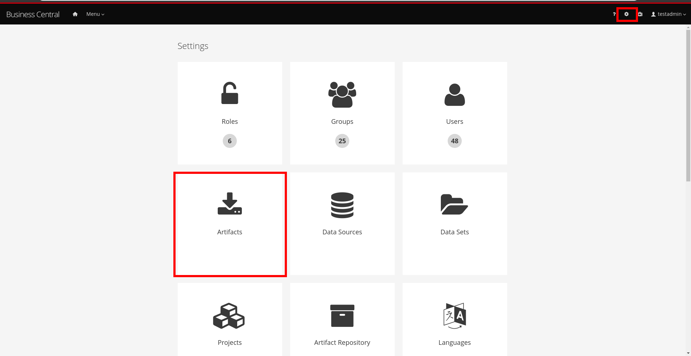
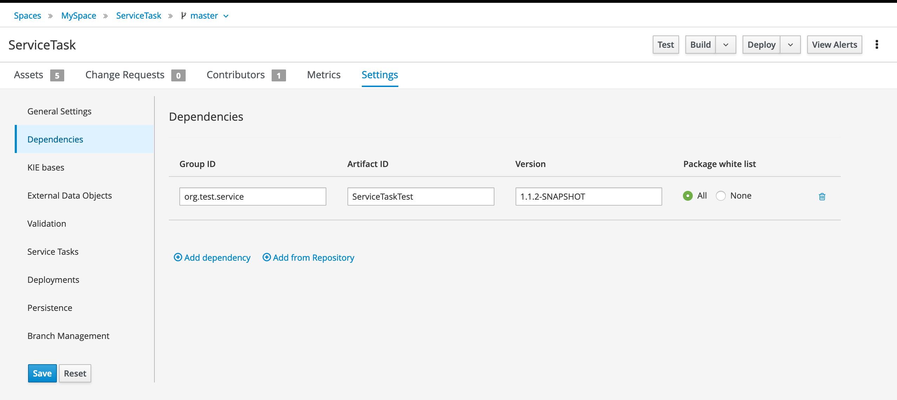

This repository contains simple Java class to use as Service task in Business Central. See https://github.com/bpmn-tutorials/ServiceTask for full tutorial.

FQN of the class (used as *Interface* property of Service task) is `org.test.service.SimpleServiceTask`.
Method of the class (should be used in *Operation* parameter of Service Task):
* `void sayHello(Object obj)` simple _hello world_ can be used without any parameters. Will print `Hello world from the Java Service Task.` string to the server console.
* `String sayHello(Object obj)` same as above but also will return `"Hello, " + obj.toString()` back to the Business Central for further usage.
* `void waitInterval(Integer seconds)` will print `"Start waiting for " + seconds + " seconds."`, wait at least 3 seconds and than print `Waiting finished successfully.`.
* `void waitInterval(Float minutes)` same as above but takes Float parameter instead of Integer

How to install to Business Central
* Execute `mvn clean package` in root directory of this repository to build project
* Upload `target/ServiceTaskTest-1.1.2-SNAPSHOT.jar` file to Business Central

* Import this Jar as dependency to your Project
